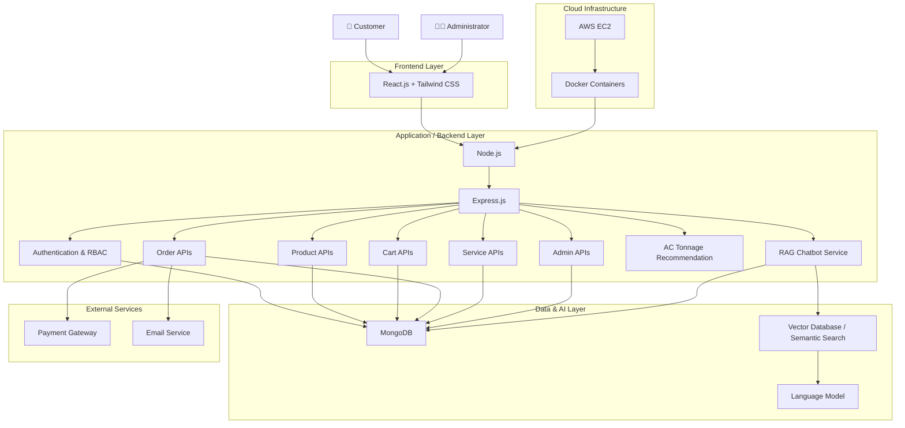

# ❄️ Smart Air Conditioner E-Commerce Platform

> **A scalable full-stack HVAC management and e-commerce platform built with MERN, Docker, and AWS EC2, featuring intelligent AC recommendations, secure order workflows, role-based administration, and a Retrieval-Augmented Generation (RAG) chatbot.**

---

## 🚀 Overview

The **Smart Air Conditioner E-Commerce Platform** is a full-stack web application designed to provide an end-to-end digital experience for purchasing, managing, and servicing air-conditioning systems.

The platform combines **e-commerce functionality with HVAC-specific intelligence**, allowing customers to discover suitable AC models, compare specifications, calculate recommended AC capacity, place and track orders, and obtain contextual assistance through an AI-powered RAG chatbot.

The backend follows a **RESTful API architecture** and is designed with modular services for authentication, products, carts, orders, and service management. Administrative functionality provides controlled access to product and order operations.

The application is containerized using **Docker** and deployed on **AWS EC2**, providing a foundation for scalable cloud deployment.

---

# ✨ Features

### 🛒 AC E-Commerce

* Browse multiple categories of air conditioners.
* Filter products based on relevant specifications.
* Search for AC models.
* View detailed product specifications.
* Compare multiple AC models.
* Display pricing and discounts.
* Add and remove products from cart.
* Manage cart quantities.
* Place customer orders.

### 🧠 Intelligent AC Recommendation

* Calculates recommended AC tonnage based on room area.
* Helps users select an appropriate AC capacity.
* Combines user input with HVAC product information.
* Reduces the need for customers to manually interpret technical specifications.

### 🔐 Authentication & Role-Based Access

* Secure user authentication.
* Role-based access control.
* Separate customer and administrator capabilities.
* Protected backend API routes.
* Authentication-aware order and account operations.

### 📦 Order Management

* Create and manage customer orders.
* Track order status throughout the purchasing workflow.
* Maintain order and product information.
* Support secure payment workflows.
* Provide customers with order-related information.

### 👨‍💼 Admin Management

* Dedicated administrative functionality.
* Product management.
* Product specification management.
* Order management.
* Controlled access to administrative APIs.
* Backend APIs for operational management.

### 🤖 RAG-Powered HVAC Chatbot

The platform includes a **Retrieval-Augmented Generation (RAG)** chatbot designed to provide context-aware customer assistance.

The chatbot:

1. Receives a user's question.
2. Converts the query into an embedding.
3. Performs semantic similarity search against HVAC knowledge.
4. Retrieves relevant product or knowledge information.
5. Provides the retrieved context to the language model.
6. Generates a context-aware response.

This allows the chatbot to answer questions using **domain-specific HVAC and product information** rather than relying only on general language-model knowledge.

### 🌐 RESTful Backend

* Modular REST APIs.
* Separate API routes for major application domains.
* Structured request/response handling.
* Authentication middleware.
* Product, cart, order, user, and service workflows.
* Designed for integration with web and future mobile clients.

### 🐳 Dockerized Application

* Containerized application environment.
* Consistent development and deployment environment.
* Simplified dependency management.
* Easy migration between development and production environments.

### ☁️ AWS Deployment

* Application deployment using **AWS EC2**.
* Cloud-hosted backend infrastructure.
* Docker-based deployment workflow.
* Foundation for future load balancing, auto scaling, and managed AWS services.

---

# 🏗️ System Architecture

The platform follows a **client-server architecture** where the React frontend communicates with the Node.js/Express backend through RESTful APIs.

The backend interacts with MongoDB for persistent application data and connects with external services for payments, email communication, and RAG-based AI functionality.



### 🔄 Request Flow

A typical customer request follows this flow:

```text
User
  ↓
React Frontend
  ↓
REST API Request
  ↓
Express.js
  ↓
Authentication / Authorization
  ↓
Business Logic
  ↓
MongoDB / External Service
  ↓
API Response
  ↓
React UI
```

For an AI chatbot request:

```text
User Question
      ↓
React Chat Interface
      ↓
RAG API
      ↓
Query Embedding
      ↓
Semantic Search
      ↓
Relevant HVAC Context
      ↓
Language Model
      ↓
Context-Aware Response
      ↓
User
```

---

# 🛠️ Technology Stack

| Layer                | Technology                           |
| -------------------- | ------------------------------------ |
| **Frontend**         | React.js                             |
| **Backend**          | Node.js, Express.js                  |
| **Database**         | MongoDB                              |
| **API Architecture** | RESTful APIs                         |
| **AI Architecture**  | Retrieval-Augmented Generation (RAG) |
| **Semantic Search**  | Vector Embeddings + Vector Database  |
| **Authentication**   | Token-based Authentication + RBAC    |
| **Payment**          | Payment Gateway Integration          |
| **Email**            | Transactional Email Service          |
| **Containerization** | Docker                               |
| **Cloud**            | AWS EC2                              |
| **Version Control**  | Git & GitHub                         |

---

# 🔒 Security Considerations

Security was considered across the application at the **frontend, API, authentication, database, and deployment layers**.

### Authentication & Authorization

* Authentication is required for protected operations.
* Role-Based Access Control separates customer and administrator capabilities.
* Administrative APIs are protected from unauthorized access.
* Authorization checks are performed on sensitive backend operations.

### API Security

* Backend validation is used for incoming requests.
* Protected routes use authentication middleware.
* Sensitive operations are handled on the server rather than trusting client-side values.
* API endpoints are logically separated according to application responsibilities.

### Data Security

* User and order information is stored in MongoDB.
* Sensitive credentials and configuration values should be supplied through environment variables.
* Secrets and API keys should not be committed to GitHub.
* Database access credentials are kept outside source code.

### Payment Security

* Payment processing is delegated to a dedicated payment gateway.
* Sensitive payment information should not be directly stored in the application database.
* Payment-related operations are handled through backend-controlled workflows.

### Container & Deployment Security

* Production configuration is separated from application source code.
* Docker provides an isolated and reproducible runtime environment.
* AWS infrastructure access should follow the principle of least privilege.
* EC2 security groups should expose only the ports required by the application.

---

# 📈 Scalability

The application is designed with scalability in mind through separation of frontend, backend, database, and AI responsibilities.

### Horizontal Scaling

The stateless REST API architecture allows multiple backend instances to serve requests simultaneously.

```text
                 ┌── Backend Instance 1
                 │
Client → Load Balancer ── Backend Instance 2
                 │
                 └── Backend Instance 3
                         │
                         ↓
                      MongoDB
```

This approach can support increasing traffic by adding additional backend instances rather than relying on a single server.

### Database Scalability

MongoDB provides flexibility for evolving product and order schemas.

Future scaling strategies can include:

* Proper indexing.
* Query optimization.
* Connection pooling.
* Database replication.
* Read scaling.
* Sharding for very large datasets.

### Caching

A caching layer such as Redis can be introduced for frequently accessed information such as:

* Product catalogs.
* Product specifications.
* Frequently asked chatbot questions.
* Session-related information.
* Rate limiting.
* Temporary application data.

### AI/RAG Scalability

The RAG architecture separates retrieval from generation, allowing the knowledge base and generation layer to evolve independently.

The system can be extended with:

* Larger knowledge bases.
* Improved embedding models.
* Hybrid keyword + semantic search.
* Metadata filtering.
* Conversation history.
* RAG evaluation and monitoring.
* Dedicated vector database infrastructure.

### Cloud Scalability

The current AWS EC2 deployment can be extended using AWS services such as:

* Elastic Load Balancing.
* EC2 Auto Scaling.
* Amazon ECS.
* Amazon ECR.
* Amazon S3.
* Managed MongoDB infrastructure.
* Cloud monitoring and logging services.

---

# 🔮 Future Improvements

### 🤖 Advanced AI Assistant

* Multi-turn conversational memory.
* Personalized product recommendations.
* Order-status assistance through natural language.
* Service and installation assistance.
* Voice-based HVAC assistant.
* Improved RAG evaluation and response quality.

### 📊 Intelligent Recommendations

Future versions can incorporate additional parameters such as:

* Room dimensions.
* Number of occupants.
* Climate conditions.
* Floor level.
* Sun exposure.
* Insulation characteristics.
* Energy-efficiency requirements.

This can evolve the current tonnage calculator into a more comprehensive **HVAC recommendation engine**.

### ⚡ Performance Improvements

* Redis-based caching.
* API response optimization.
* Database indexing.
* CDN integration.
* Lazy loading and code splitting.
* Background job processing.

### 📨 Event-Driven Architecture

The platform can be extended with a message broker such as RabbitMQ or Kafka for asynchronous operations including:

* Order notifications.
* Email processing.
* Inventory updates.
* Service assignment.
* Payment events.
* Background AI processing.

### ☁️ Cloud-Native Deployment

The current Docker + AWS EC2 deployment can evolve toward:

```text
Docker
   ↓
Amazon ECR
   ↓
Amazon ECS
   ↓
Load Balancer
   ↓
Auto Scaling
   ↓
Monitoring & Logging
```

This would provide a more automated and scalable production deployment architecture.

### 📦 Inventory Management

Future versions can include:

* Real-time inventory tracking.
* Low-stock alerts.
* Warehouse management.
* Product availability synchronization.
* Automated inventory updates after successful orders.

### 🔧 Service Management

The service module can be expanded with:

* Technician availability tracking.
* Automated technician assignment.
* Installation scheduling.
* Service history.
* Preventive maintenance reminders.
* Customer service ratings.

---

# 🎓 Learning Outcomes

This project provided practical experience across multiple areas of modern software engineering.

### Full-Stack Development

* Developed a complete MERN-based application.
* Connected React frontend with RESTful backend services.
* Implemented real-world business workflows.

### Backend Engineering

* Designed modular REST APIs.
* Implemented authentication and authorization.
* Built product, cart, order, service, and administrative workflows.
* Worked with middleware and backend business logic.

### Database Engineering

* Designed MongoDB data models.
* Implemented CRUD operations.
* Worked with relationships between users, products, carts, and orders.
* Learned database-oriented application design.

### AI & RAG

* Learned the architecture of Retrieval-Augmented Generation.
* Worked with embeddings and semantic search.
* Connected retrieved domain-specific context with a language model.
* Built an AI assistant around real application data.

### DevOps

* Containerized the application using Docker.
* Learned reproducible application deployment.
* Worked with environment-based configuration.
* Gained practical experience deploying applications on AWS EC2.

### Software Architecture

* Applied layered application architecture.
* Separated frontend, API, data, AI, and external service responsibilities.
* Designed the system with future horizontal scaling in mind.
* Considered caching, asynchronous processing, load balancing, and cloud-native deployment.

### Engineering Practices

* Used Git and GitHub for version control.
* Designed modular and maintainable backend components.
* Considered security throughout the application lifecycle.
* Applied scalability and production-readiness concepts to a real-world application.

---

## 💡 Project Highlights

```text
MERN Full Stack
      +
RESTful APIs
      +
Role-Based Access Control
      +
AC Tonnage Recommendation
      +
Secure Order Workflow
      +
Payment Integration
      +
RAG-Based AI Assistant
      +
Docker
      +
AWS EC2
```

> **Built as a practical demonstration of full-stack development, backend engineering, AI integration, containerization, cloud deployment, and scalable software architecture.**
